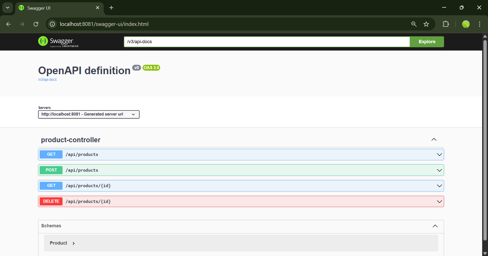
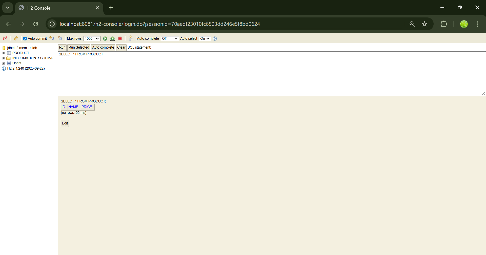

# CTSE DevOps Lab 3 – Spring Boot Microservice

 

**Project:** This is a Spring Boot microservice application developed for CTSE Lab 03 .(Spring Boot Microservice with H2 Database & Swagger UI)

---

---

## 🔹 Screenshots

### API Documentation – Swagger UI

### H2 Database Console

---

## 🛠️ Technologies Used
- Java  
- Spring Boot  
- Spring Web  
- Spring Data JPA  
- H2 Database  
- Springdoc OpenAPI (Swagger UI)  
- Maven  

---

